# Backend Setup for ZAINA COLLECTION

This document provides a step-by-step guide to building a robust backend for the ZAINA COLLECTION e-commerce website. It outlines the recommended technology stack, project structure, database models, and API endpoints required to support the frontend application.

## 1. Recommended Technology Stack

For a modern, scalable, and maintainable e-commerce backend, we recommend the following technologies:

-   **Runtime Environment:** [Node.js](https://nodejs.org/) (LTS version)
-   **Framework:** [Express.js](https://expressjs.com/)
-   **Database:** [MongoDB](https://www.mongodb.com/) (for flexible, scalable document storage).
-   **ODM (Object-Document Mapper):** [Prisma](https://www.prisma.io/) (for type-safe database access)
-   **Authentication:** [JSON Web Tokens (JWT)](https://jwt.io/)
-   **Media Storage:** [AWS S3](https://aws.amazon.com/s3/) or Google Cloud Storage (for scalable image and video hosting)
-   **Payment Gateway:** [Razorpay](https://razorpay.com/) (as it's already integrated in the frontend)
-   **Language:** [TypeScript](https://www.typescriptlang.org/)

## 2. Setup and Running

Follow these steps precisely to get the backend server running.

**Step 1: Install Dependencies**
Navigate to the `backend` directory in your terminal.
```bash
cd backend
npm install
```

**Step 2: Set Up Environment Variables**
In the `backend` directory, create a `.env` file. Copy the contents from the example below and fill in your actual credentials.

```env
# .env

# Database: Replace with your MongoDB connection string from MongoDB Atlas
DATABASE_URL="mongodb+srv://<USER>:<PASSWORD>@<CLUSTER>/<DATABASE_NAME>?retryWrites=true&w=majority"

# JWT
JWT_SECRET="YOUR_SUPER_SECRET_JWT_KEY"
JWT_EXPIRES_IN="7d"

# Server
PORT=5000

# Razorpay
RAZORPAY_KEY_ID="YOUR_RAZORPAY_KEY_ID"
RAZORPAY_KEY_SECRET="YOUR_RAZORPAY_KEY_SECRET"

# AWS S3 for Media Storage
AWS_ACCESS_KEY_ID="YOUR_AWS_ACCESS_KEY"
AWS_SECRET_ACCESS_KEY="YOUR_AWS_SECRET_KEY"
AWS_S3_BUCKET_NAME="your-s3-bucket-name"
AWS_S3_REGION="your-s3-bucket-region"
```

**Step 3: Generate Prisma Client**
This is a **crucial** step. It generates the type-safe database client based on your schema. Run this after `npm install` and any time you change `schema.prisma`.
```bash
npx prisma generate
```

**Step 4: Run the Server**
This command starts the backend server in development mode. It will automatically restart when you make code changes.
```bash
npm run dev
```
You should see `[server]: Server is running at http://localhost:5000`. **You must keep this terminal window open while using the frontend application.**

## 3. Data Structure & Database Schema (Prisma)

The data structure is defined in `backend/prisma/schema.prisma` and is based directly on your frontend's `types.ts` file. This ensures consistency between the frontend and backend.

### 3.1. Database Flow Diagram (ERD)

The following diagram illustrates the relationships between the major entities in the database.


## 4. API Endpoints

The backend exposes the following REST API endpoints. All routes are prefixed with `/api`.

#### Authentication (`/auth`)
-   `POST /register`: Create a new user account.
-   `POST /login`: Log in a user and return a JWT.

#### Products (`/products`) - *Public*
-   `GET /`: Get a list of all published products.
-   `GET /:slug`: Get details for a single product by its slug.

#### Cart (`/cart`) - *Protected Route (requires JWT)*
-   `GET /`: Get the current user's cart items.
-   `POST /`: Add an item to the cart.
-   `PUT /:variantId`: Update quantity of an item in the cart.
-   `DELETE /:variantId`: Remove an item from the cart.

#### Orders (`/orders`) - *Protected Route*
-   `POST /payment/create`: Create a Razorpay order ID.
-   `POST /`: Create a new order.

#### User Profile (`/user`) - *Protected Route*
-   `GET /profile`, `PUT /profile`: Manage user profile.
-   `GET /addresses`, `POST /addresses`, `PUT /addresses/:id`, `DELETE /addresses/:id`: Full CRUD for user addresses.
-   `GET /orders`: Get the user's order history.

#### Media (`/media`) - *Protected Route*
-   `GET /presigned-url`: Get a secure URL to upload a file to AWS S3.

#### Admin Panel (`/admin`) - *Admin Protected Routes*
-   `POST /products`, `PUT /products/:id`, `DELETE /products/:id`: Manage products.
-   `GET /orders`, `PUT /orders/:id/status`: Manage orders.

## 5. User Flow Diagram

This diagram illustrates the primary paths a user can take through the application.

```mermaid
graph TD
    subgraph "Browsing & Shopping"
        A[Homepage] --> B(Shop Page);
        A --> C{Product Detail};
        B --> C;
        C --> D[Add to Cart];
        D --> E(Cart Page);
    end

    subgraph "Authentication & Checkout"
        E --> F{Auth Wall};
        F -- Login/Register --> G[Authenticated Session];
        G --> H(Checkout Page);
        H --> I[Payment Process];
        I --> J(✅ Order Success);
    end

    subgraph "User Dashboards"
        G --> K{Role Check};
        K -- User Role --> L[User Dashboard];
        K -- Admin Role --> M[Admin Dashboard];
    end
```



## 6. Authentication & Security

1.  **Password Hashing:** Passwords are never stored in plain text. We use `bcryptjs` to hash and salt passwords.
2.  **JSON Web Tokens (JWT):** When a user logs in, the server issues a signed JWT. This token must be sent in the `Authorization` header for protected requests.
3.  **Middleware Protection:**
    -   `isAuthenticated`: Middleware that checks for a valid JWT.
    -   `isAdmin`: Middleware that checks if the authenticated user has the 'ADMIN' role.
4.  **Environment Variables:** All secrets are stored in a `.env` file, which is kept out of version control.

## 7. Media (Image/Video) Handling

We use a **pre-signed URL** strategy with AWS S3 for scalable uploads:
1.  The frontend requests a secure upload URL from the backend.
2.  The backend generates a temporary URL using the AWS SDK that grants permission to upload directly to your S3 bucket.
3.  The frontend uploads the file straight to S3. This keeps heavy traffic off our server.
4.  The final URL of the uploaded file is then stored in our database.

## 8. Troubleshooting

### "Network Error" or "Failed to Fetch" on Frontend

This is a very common issue. **99% of the time, it means the backend server is not running or not reachable from your browser.**

Follow these steps to fix it:

**1. Is the Server Running?**
   - Look at the terminal where you ran `npm run dev`. Does it say `[server]: Server is running at http://localhost:5000`?
   - If it shows an error, there might be a problem with your `.env` file or database connection. Read the error message carefully.
   - **Remember:** The backend server must be running in its own terminal for the frontend to talk to it.

**2. Can you reach the server directly?**
   - Open a **new** terminal window (while the server is still running).
   - Run the following command:
     ```bash
     curl http://localhost:5000/api/products
     ```
   - **If you see a JSON response (even an empty one like `{"products":[]}`):** The backend is working correctly! The problem is likely a browser issue (like a misbehaving extension).
   - **If you see `curl: (7) Failed to connect to localhost port 5000: Connection refused`:** This confirms your backend server is **NOT** running or is blocked by a firewall. Go back to Step 1.