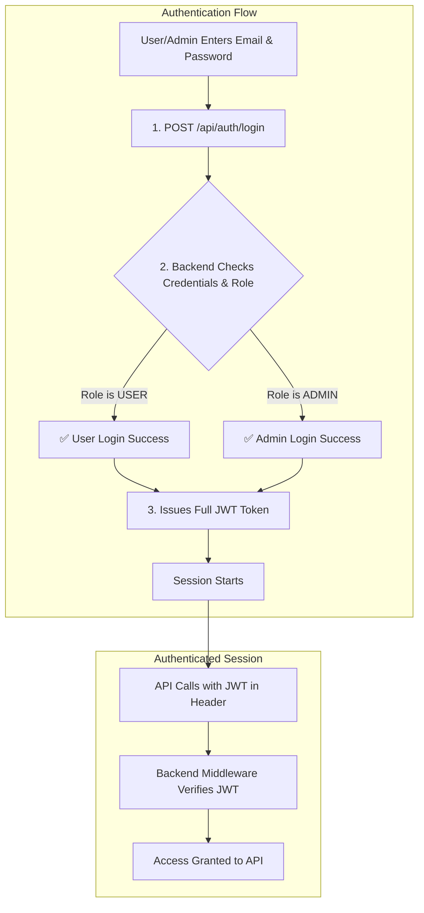

# ZAINA COLLECTION - Backend Documentation

This document provides a comprehensive, step-by-step guide to setting up and running the backend for the ZAINA COLLECTION e-commerce website. It covers the technology stack, project architecture, data flows, and crucial setup instructions.

## 1. Technology Stack

-   **Runtime Environment:** [Node.js](https://nodejs.org/) (LTS version)
-   **Framework:** [Express.js](https://expressjs.com/)
-   **Database:** [MongoDB](https://www.mongodb.com/)
-   **ODM (Object-Document Mapper):** [Prisma](https://www.prisma.io/)
-   **Authentication:** [JSON Web Tokens (JWT)](https://jwt.io/)
-   **Media Storage:** [Google Cloud Storage (GCS)](https://cloud.google.com/storage)
-   **Payment Gateway:** [Razorpay](https://razorpay.com/)
-   **Language:** [TypeScript](https://www.typescriptlang.org/)

---

## 2. How to Run the Application (Foolproof Checklist)

To avoid common errors, follow this sequence **exactly** every time you start working. You will need **TWO** separate terminals open: one for the backend and one for the frontend.

**Step 1: Install Dependencies**
Navigate to the `backend` directory in your first terminal.
```bash
cd backend
npm install
```

**Step 2: Set Up Environment Variables (`.env` file)**
In the `backend` directory, create a new file named `.env`. Copy the contents from the example below and fill in your actual credentials. **This is a mandatory step.**

```env
# .env - COPY THIS INTO YOUR FILE

# Database: Replace with your MongoDB connection string from MongoDB Atlas
DATABASE_URL="mongodb+srv://<USER>:<PASSWORD>@<CLUSTER>/<DATABASE_NAME>?retryWrites=true&w=majority"

# JWT: Use a long, random string for the secret
JWT_SECRET="YOUR_SUPER_SECRET_JWT_KEY_-a7g6f5d4a6f87ad6"
JWT_EXPIPIRES_IN="7d"

# Server Port
PORT=5000

# Razorpay API Keys
RAZORPAY_KEY_ID="YOUR_RAZORPAY_KEY_ID"
RAZORPAY_KEY_SECRET="YOUR_RAZORPAY_KEY_SECRET"

# --- Google Cloud Storage (GCS) for Media Uploads ---
# This is the name of the bucket you create in Google Cloud Storage.
GCS_BUCKET_NAME="your-gcs-bucket-name"
# This tells the backend where to find your credentials file (see Step 3).
# The path must be relative to the backend directory.
GOOGLE_APPLICATION_CREDENTIALS="./google-credentials.json"

# Nodemailer for Sending Emails (e.g., using Gmail)
# IMPORTANT: For Gmail, you will need to create an "App Password".
# See: https://support.google.com/accounts/answer/185833
EMAIL_HOST="smtp.gmail.com"
EMAIL_PORT="587"
EMAIL_SECURE="false" # Use "true" for port 465, "false" for others
EMAIL_USER="your-email@gmail.com"
EMAIL_PASS="your-16-digit-gmail-app-password"
```

**Step 3: Set Up Google Cloud Storage (for Media Manager)**
The Media Manager requires Google Cloud Storage to upload and store images. Follow these steps to generate the necessary credentials file.

1.  **Go to Google Cloud Console:** Visit [console.cloud.google.com](https://console.cloud.google.com/).
2.  **Create a Project:** Create a new project or select an existing one.
3.  **Create a Storage Bucket:** Navigate to **Cloud Storage -> Buckets** and create a new bucket. Make sure you give it a unique name and set the "Access control" to **"Fine-grained"**. This bucket name is your `GCS_BUCKET_NAME`.
4.  **Create a Service Account:**
    -   Navigate to **IAM & Admin -> Service Accounts**.
    -   Click **"Create Service Account"**. Give it a name (e.g., `zaina-storage-manager`).
    -   In the "Grant this service account access to project" step, add the role **"Storage Admin"**.
    -   Click **"Done"**.
5.  **Generate a JSON Key:**
    -   Find your new service account in the list, click the three dots (...) under "Actions", and select **"Manage keys"**.
    -   Click **"Add Key" -> "Create new key"**.
    -   Choose **JSON** as the key type and click **"Create"**. A `.json` file will be downloaded to your computer.
6.  **Place and Rename the Key:**
    -   Rename the downloaded `.json` file to `google-credentials.json`.
    -   Move this `google-credentials.json` file into your `backend/` directory.

**Step 4: Generate Prisma Client**
This is a **crucial** step. It reads your database schema and generates the type-safe code your application needs to talk to the database. Run this after `npm install` and **any time you change `prisma/schema.prisma`**.

```bash
npx prisma generate
```

**Step 5: Run the Server**
This command starts the backend server in development mode. It will automatically restart when you make code changes.
```bash
npm run dev
```
You should see `[server]: Server is running at http://localhost:5000`. **You must keep this terminal window open while using the frontend application.**

---

## 3. How to Make a User an Admin

For security reasons, there is **no public API endpoint** to create an admin. This must be done manually by someone with database access.

**Steps:**
1.  Connect to your MongoDB database using a tool like MongoDB Compass or the `mongosh` command-line interface.
2.  Navigate to your database and open the `User` collection.
3.  Find the user you want to make an admin (you can search by their email).
4.  Edit their document and change the `role` field from `"USER"` to `"ADMIN"`.
5.  Save the document. The next time this user logs in, they will have admin privileges.

---

## 4. Application Architecture & Flow

### 4.1. User Data Flow (Kaise Kaam Karta Hai?)

The entire user journey is designed to be secure and logical. The diagram below shows the data flow from login to an authenticated session.



---

## 5. Full Prisma Schema (`schema.prisma`)

This is the complete, up-to-date schema for the database, located at `backend/prisma/schema.prisma`. It reflects all features of the application, including the full admin and user dashboards.

```prisma
// This is your Prisma schema file,
// learn more about it in the docs: https://pris.ly/d/prisma-schema

generator client {
  provider = "prisma-client-js"
}

datasource db {
  provider = "mongodb"
  url      = env("DATABASE_URL")
}

// --- USER MODELS ---

model User {
  id                         String    @id @default(auto()) @map("_id") @db.ObjectId
  name                       String
  email                      String    @unique
  password                   String
  role                       String    @default("USER") // USER or ADMIN
  phone                      String?
  dateOfBirth                DateTime?
  profilePictureUrl          String?
  joinDate                   DateTime  @default(now())
  isBlocked                  Boolean   @default(false)
  wishlistProductIds         String[]  @db.ObjectId
  recentlyViewedProductIds   String[]  @db.ObjectId

  // Relations
  addresses      Address[]
  orders         Order[]
  cart           Cart?
  supportTickets SupportTicket[]
  paymentMethods PaymentMethod[]
  activityLog    AdminActivityLog[]
  chatSessions   ChatSession[]
  reviews        ProductReview[]
}

model Address {
  id           String  @id @default(auto()) @map("_id") @db.ObjectId
  type         String // shipping or billing
  fullName     String
  addressLine1 String
  addressLine2 String?
  city         String
  state        String
  postalCode   String
  country      String
  phone        String?
  isDefault    Boolean @default(false)

  // Relations
  userId String @db.ObjectId
  user   User   @relation(fields: [userId], references: [id], onDelete: Cascade)

  @@index([userId])
}

model PaymentMethod {
  id          String  @id @default(auto()) @map("_id") @db.ObjectId
  type        String // card
  last4       String
  expiryMonth String
  expiryYear  String
  brand       String
  isDefault   Boolean @default(false)

  // Relations
  userId String @db.ObjectId
  user   User   @relation(fields: [userId], references: [id], onDelete: Cascade)

  @@index([userId])
}


// --- E-COMMERCE MODELS ---

model Product {
  id                  String           @id @default(auto()) @map("_id") @db.ObjectId
  name                String
  slug                String           @unique
  price               Float // Selling Price
  mrp                 Float // MRP
  imageUrl            String
  images              String[]
  description         String
  longDescriptionHtml String?
  sku                 String?          @unique
  tags                String[]
  categoryName        String?
  subCategoryName     String?
  isNew               Boolean          @default(false)
  isBestSeller        Boolean          @default(false)
  rating              Float?
  stockQuantity       Int?
  publishStatus       String           @default("Draft") // Draft, Published, Hidden
  gender              String?
  isTaxable           Boolean?
  specifications      Json[]
  brand               String?
  vendor              String?
  metaTitle           String?
  metaDescription     String?
  bannerImageUrl      String?
  bannerLink          String?
  faqs                Json[]

  // Relations
  variants   ProductVariant[]
  orderItems OrderItem[]
  cartItems  CartItem[]
  reviews    ProductReview[]

  @@index([categoryName])
  @@index([slug])
}

model ProductVariant {
  id            String @id @default(auto()) @map("_id") @db.ObjectId
  price         Float
  stockQuantity Int
  sku           String @unique
  imageUrl      String?
  attributes    Json // { "Color": "Red", "Size": "M" }

  // Relations
  productId  String     @db.ObjectId
  product    Product    @relation(fields: [productId], references: [id], onDelete: Cascade)
  orderItems OrderItem[]
  cartItems  CartItem[]

  @@index([productId])
}

model Category {
  id            String     @id @default(auto()) @map("_id") @db.ObjectId
  name          String     @unique

  // Self-relation for subcategories
  parentId      String?    @db.ObjectId
  parent        Category?  @relation("SubCategories", fields: [parentId], references: [id], onDelete: NoAction, onUpdate: NoAction)
  subCategories Category[] @relation("SubCategories")
}

model VariantAttribute {
  id     String   @id @default(auto()) @map("_id") @db.ObjectId
  name   String   @unique // e.g., "Size", "Color"
  values String[]
}


model Order {
  id                String      @id @default(auto()) @map("_id") @db.ObjectId
  orderDate         DateTime    @default(now())
  totalAmount       Float
  status            String // Pending, Processing, Shipped, Delivered, Cancelled, Refunded, Returned
  shippingAddress   Json
  trackingNumber    String?
  paymentType       String?
  deliveryType      String?
  deliveryCharge    Float?
  appliedCouponCode String?
  discountAmount    Float?
  transactionId     String?
  paymentStatus     String? // Success, Failed, Pending
  customerName      String

  // Relations
  userId String? @db.ObjectId
  user   User?   @relation(fields: [userId], references: [id])
  items  OrderItem[]

  @@index([userId])
}

model OrderItem {
  id              String         @id @default(auto()) @map("_id") @db.ObjectId
  quantity        Int
  priceAtPurchase Float
  variantSnapshot Json

  // Relations
  orderId   String         @db.ObjectId
  order     Order          @relation(fields: [orderId], references: [id], onDelete: Cascade)
  productId String         @db.ObjectId
  product   Product        @relation(fields: [productId], references: [id])
  variantId String         @db.ObjectId
  variant   ProductVariant @relation(fields: [variantId], references: [id])

  @@index([orderId])
}

model Cart {
  id     String     @id @default(auto()) @map("_id") @db.ObjectId
  userId String     @unique @db.ObjectId
  user   User       @relation(fields: [userId], references: [id], onDelete: Cascade)
  items  CartItem[]
}

model CartItem {
  id        String         @id @default(auto()) @map("_id") @db.ObjectId
  quantity  Int

  // Relations
  cartId    String         @db.ObjectId
  cart      Cart           @relation(fields: [cartId], references: [id], onDelete: Cascade)
  productId String         @db.ObjectId
  product   Product        @relation(fields: [productId], references: [id])
  variantId String         @db.ObjectId
  variant   ProductVariant @relation(fields: [variantId], references: [id])

  @@index([cartId])
}


// --- DYNAMIC CONTENT MODELS ---

model HeroSlide {
  id          String  @id @default(auto()) @map("_id") @db.ObjectId
  imageUrl    String
  title       String?
  caption     String?
  ctaText     String?
  ctaLink     String?
  order       Int
  isActive    Boolean @default(true)
  ratingText  String?
  modelImageUrl String?
}

model OccasionContent {
  id          String @id @default(auto()) @map("_id") @db.ObjectId
  name        String @unique // e.g., "Wedding", "Festive"
  title       String
  description String
  imageUrl    String
}

model CuratedLook {
  id          String   @id @default(auto()) @map("_id") @db.ObjectId
  title       String
  description String
  imageUrl    String
  productIds  String[] @db.ObjectId
}

model EmotionCategory {
  id          String @id @default(auto()) @map("_id") @db.ObjectId
  name        String @unique
  emotionTag  String @unique
  imageUrl    String
  description String
}

model ShoppableVideo {
  id                 String   @id @default(auto()) @map("_id") @db.ObjectId
  videoUrl           String
  thumbnailUrl       String
  title              String
  tag                String?
  featuredProductIds String[] @db.ObjectId
}

model Testimonial {
  id              String  @id @default(auto()) @map("_id") @db.ObjectId
  userImage       String
  userName        String
  userHandle      String?
  quote           String
  productImageUrl String?
  rating          Int?
  approved        Boolean @default(false)
}

model FashionGalleryImage {
  id       String  @id @default(auto()) @map("_id") @db.ObjectId
  imageUrl String
  order    Int
  isActive Boolean @default(true)
}

model GuidedDiscoveryPath {
  id            String @id @default(auto()) @map("_id") @db.ObjectId
  prompt        String
  targetFilters Json
}

model ActivityLog {
  id        String   @id @default(auto()) @map("_id") @db.ObjectId
  message   String
  timestamp DateTime @default(now())
}

model FloatingInfo {
  id               String @id @default(auto()) @map("_id") @db.ObjectId
  corner           String // topLeft, topRight, bottomLeft, bottomRight
  text             String
  triggerSectionId String?
}

model MediaFile {
  id        String   @id @default(auto()) @map("_id") @db.ObjectId
  name      String
  url       String
  size      Float
  type      String // image, video
  createdAt DateTime @default(now())
}

model ProductReview {
  id        String   @id @default(auto()) @map("_id") @db.ObjectId
  rating    Int
  comment   String
  createdAt DateTime @default(now())
  approved  Boolean  @default(false)

  // Relations
  userId    String  @db.ObjectId
  user      User    @relation(fields: [userId], references: [id], onDelete: Cascade)
  productId String  @db.ObjectId
  product   Product @relation(fields: [productId], references: [id], onDelete: Cascade)

  @@index([userId])
  @@index([productId])
}

model Faq {
  id       String  @id @default(auto()) @map("_id") @db.ObjectId
  question String
  answer   String
  order    Int
  isActive Boolean @default(true)
}

// --- ADMIN & SETTINGS MODELS ---

model SupportTicket {
  id          String   @id @default(auto()) @map("_id") @db.ObjectId
  subject     String
  status      String // Open, In Progress, Resolved, Closed
  lastUpdated DateTime @updatedAt
  createdAt   DateTime @default(now())
  messages    Json[] // [{ sender, text, timestamp }]

  // Relations
  userId      String   @db.ObjectId
  user        User     @relation(fields: [userId], references: [id], onDelete: Cascade)
  assignedTo  String?  @db.ObjectId // Admin User ID

  @@index([userId])
}

model ChatSession {
  id          String        @id @default(auto()) @map("_id") @db.ObjectId
  createdAt   DateTime      @default(now())
  lastUpdated DateTime      @updatedAt

  // Relations
  userId   String        @db.ObjectId
  user     User          @relation(fields: [userId], references: [id], onDelete: Cascade)
  messages ChatMessage[]

  @@index([userId])
}

model ChatMessage {
  id        String   @id @default(auto()) @map("_id") @db.ObjectId
  sender    String // user or admin
  text      String
  timestamp DateTime @default(now())

  // Relations
  sessionId String      @db.ObjectId
  session   ChatSession @relation(fields: [sessionId], references: [id], onDelete: Cascade)

  @@index([sessionId])
}

model CmsPage {
  id               String   @id @default(auto()) @map("_id") @db.ObjectId
  type             String // page, post
  title            String
  slug             String   @unique
  content          String // HTML content
  metaTitle        String
  metaDescription  String
  status           String // Published, Draft
  lastUpdated      DateTime @updatedAt
  lastUpdatedBy    String // Admin User Name
  featuredImageUrl String?
}

model AdminActivityLog {
  id            String   @id @default(auto()) @map("_id") @db.ObjectId
  timestamp     DateTime @default(now())
  action        String
  details       String?
  ipAddress     String?

  // Relations
  adminUserId String @db.ObjectId
  adminUser   User   @relation(fields: [adminUserId], references: [id])

  @@index([adminUserId])
}

model Coupon {
  id          String    @id @default(auto()) @map("_id") @db.ObjectId
  code        String    @unique
  type        String // percentage, fixed_amount, bogo
  value       Float
  description String?
  startDate   DateTime?
  endDate     DateTime?
  usageLimit  Int?
  usageCount  Int       @default(0)
  isActive    Boolean   @default(true)
  rules       String?
}

model CustomerGroup {
  id          String @id @default(auto()) @map("_id") @db.ObjectId
  name        String @unique
  memberCount Int
  rules       String
}

model MarketingCampaign {
  id         String    @id @default(auto()) @map("_id") @db.ObjectId
  name       String
  type       String // email, push
  subject    String?
  content    String
  status     String // Draft, Sent, Active
  sentAt     DateTime?
  recipients Int?
}

model SiteSettings {
  id           String @id @default(auto()) @map("_id") @db.ObjectId
  singleton    String @unique @default("global_settings")
  storeSettings    Json
  seoSettings      Json
  themeSettings    Json
  headerLinks      Json[]
  footerSettings   Json
  integrations     Json
}

model ShippingZone {
  id        String   @id @default(auto()) @map("_id") @db.ObjectId
  name      String
  countries String[]
  states    String[]
  postcodes String[]

  // Relations
  rates ShippingRate[]
}

model ShippingRate {
  id             String  @id @default(auto()) @map("_id") @db.ObjectId
  name           String
  price          Float
  condition      String? // min_order_value, weight_based
  conditionValue Float?

  // Relations
  zoneId String       @db.ObjectId
  zone   ShippingZone @relation(fields: [zoneId], references: [id], onDelete: Cascade)

  @@index([zoneId])
}

model ShippingProvider {
  id        String  @id @default(auto()) @map("_id") @db.ObjectId
  name      String  @unique // e.g., 'Shiprocket'
  apiKey    String?
  apiSecret String?
  enabled   Boolean
}

model PaymentGateway {
  id       String  @id @default(auto()) @map("_id") @db.ObjectId
  name     String  @unique
  enabled  Boolean
  settings Json // { apiKey, apiSecret }
}
```

## 6. Troubleshooting

### Problem: "Network Error" or "Failed to Fetch" on Frontend
This is the most common issue. **99% of the time, it means the backend server is not running or not reachable from your browser.**

**1. Is the Server Running?**
   - Look at the terminal where you ran `npm run dev`. Does it say `[server]: Server is running at http://localhost:5000`?
   - If it shows an error, there is likely a problem with your `.env` file (e.g., wrong database URL) or a code error. Read the terminal output carefully.
   - **Remember:** The backend server must be running in its own terminal for the frontend to talk to it.

**2. Can you reach the server directly?**
   - Open a **new** terminal window (while the server is still running).
   - Run the following command:
     ```bash
     curl http://localhost:5000/api/products
     ```
   - **If you see a JSON response (even an empty one):** The backend is working correctly! The problem is likely a browser issue (like a misbehaving extension) or a CORS problem if you changed the default settings.
   - **If you see `curl: (7) Failed to connect to localhost port 5000: Connection refused`:** This confirms your backend server is **NOT** running or is blocked by a firewall. Go back to Step 1.
